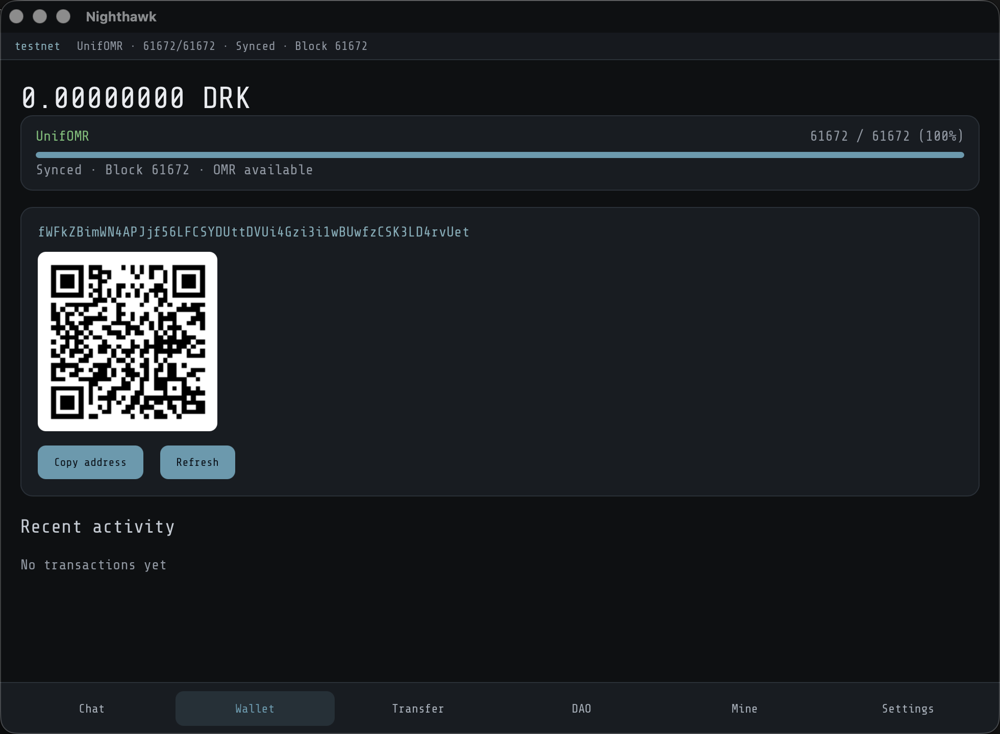

# Nighthawk Desktop

<p align="center">
  
</p>

Cross-platform DarkFi wallet for desktop ([`nighthawk-apps/nighthawk-desktop`](https://github.com/nighthawk-apps/nighthawk-desktop)):

- **Lit** UI (Chat · Wallet · Transfer · **Mine** · Settings)
- **Tauri 2** Rust host
- Same **`darkfi-mobile-ffi`** UniFFI crate as Android (tip `drk` turso/aegis256 wallet, UnifOMR sync, DarkIRC, send/receive)
- **Instant sync & checkpoints:** authenticated `TreeState` restore, real birthday clamping, UnifOMR pipelining, and ZKAS caching (see [docs/instant-sync-strategy.md](docs/instant-sync-strategy.md))
- **Proto version lockstep:** validates lightwalletd `proto_version` (1.x.x) and renders warning banner on protocol mismatches
- Local **disk vault** (AES-GCM + PBKDF2) for seed + `wallet_pass` — **no app PIN**; the wallet opens automatically. Treat the data directory as sensitive (anyone with the files can decrypt).
- Separate data dirs per **testnet / mainnet**, plus optional **multi-wallet** profiles
- Product surface: tokens, memos, DAO, Arti Tor, DarkIRC E2E DM, address book
- Bundled **xmrig** mining to your deposit address via local darkfid stratum
- **Tor on by default** for remote lightwalletd / chat (embedded Arti). Default testnet LWD is loopback `http://127.0.0.1:9067`; switch URL in Settings for a remote pin.
- **Trial-decrypt fallback (default on):** receives payments from non-UnifOMR wallets (e.g. upstream `drk`) by trial-decrypting compact blocks when UnifOMR finds no matches. Toggle **Strict UnifOMR sync** in Settings to make sync UnifOMR-only (more private / faster when counterparties also use UnifOMR).
- UnifOMR Param2 limits: [`docs/unifomr_mvp_limits.md`](docs/unifomr_mvp_limits.md)

## Prerequisites

- Rust toolchain, Node 20+, `pnpm`
- macOS: Xcode CLT (for local macOS builds)
- Reachable **darkfi-lightwalletd** (default testnet: `http://127.0.0.1:9067`; remote HTTPS still needs a TLS pin)
- **Sibling directory literally named `new-nighthawk-android-wallet`** (Cargo path-depends on `../../new-nighthawk-android-wallet/rust/darkfi-mobile-ffi`). A repo named `nighthawk-android-wallet` is not enough unless you add that symlink.
- For mining: **darkfid** with stratum (`:18347` testnet / `:8347` mainnet)

## Repository layout

Path dependencies use **sibling directory names** (see `src-tauri/Cargo.toml`):

```text
parent/
  darkfi/                          # unused by Cargo; FFI uses Android third_party
  darkfi-nighthawk-testnet/        # nighthawk24 pin (also Android third_party/darkfi)
  darkfi-lightwalletd/             # lightwalletd + UnifOMR reference
  new-nighthawk-android-wallet/    # provides rust/darkfi-mobile-ffi (required)
  nighthawk-app-desktop/           # this repo
  # optional:
  nighthawk-ios-wallet/
  moonshine/
```

`src-tauri/Cargo.toml` path-depends on:

```text
../../new-nighthawk-android-wallet/rust/darkfi-mobile-ffi
```

Do **not** point at a `darkfi-mobile-ffi` symlink at the GitHub root — Cargo resolves the FFI crate’s relative `third_party/darkfi` from the real Android tree path.

`src-tauri/Cargo.lock` is committed so release builds stay reproducible.

## Develop

```bash
cd nighthawk-app-desktop
pnpm install
# Optional if the default cargo git cache is not writable:
#   export CARGO_HOME=$HOME/.cargo-nh
pnpm tauri dev
```

## Build

`src-tauri/Cargo.toml` requires a sibling **`new-nighthawk-android-wallet`** (symlink that name to your Android checkout if needed).

```bash
# Dev / compile the .app only (skips Finder/AppleScript DMG layout):
CI=true pnpm tauri build

# Or skip the DMG bundle:
pnpm tauri build --bundles app
```

Without `CI=true`, `bundle_dmg.sh` fails in non-GUI / agent shells (it drives Finder via AppleScript). The binary and `.app` still compile; only the DMG step needs a real Finder session or `CI=true`.

## xmrig sidecar

Place platform binaries under `src-tauri/binaries/` named for Tauri externals:

- `xmrig-aarch64-apple-darwin`
- `xmrig-x86_64-apple-darwin`
- `xmrig-x86_64-unknown-linux-gnu`
- `xmrig-x86_64-pc-windows-msvc.exe`

Or install system `xmrig` — the app can fall back to `/opt/homebrew/bin/xmrig` on macOS.

```bash
./scripts/fetch-xmrig.sh
```

## Data paths (macOS)

`~/Library/Application Support/nighthawk-app-desktop/`

- `prefs.json`
- `{testnet,mainnet}/wallet.db` (turso + experimental aegis256; wipe after DarkFi pin bumps that change wallet format)
- `{testnet,mainnet}/cache/`
- `{testnet,mainnet}/darkirc_db/`
- Local vault: `vault.meta.json` + `vault.dat` (desktop-sealed, **not** a user PIN)

## Privacy / Tor

`use_tor` defaults to **true**. Remote lightwalletd and DarkIRC exit via Arti SOCKS. Disable Tor in Settings only for loopback/dev testing.

Changing LWD URL, TLS pin, Tor, or network closes the open wallet handle — reopen the wallet after Save.

## Mine tab

Unlock wallet → Mine → set threads → Start. Payouts go to `primary_deposit_address`. Stratum URL is editable in Settings.
